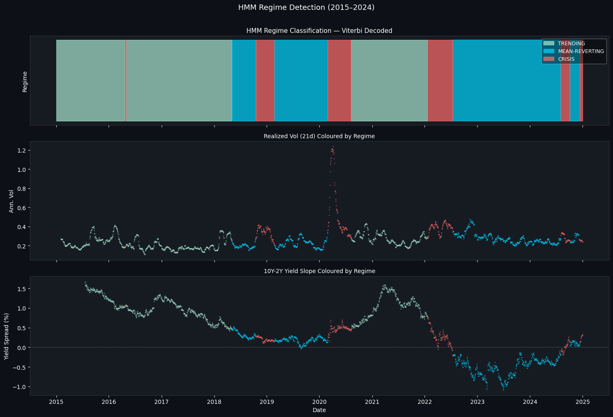
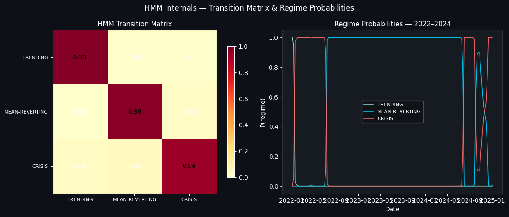
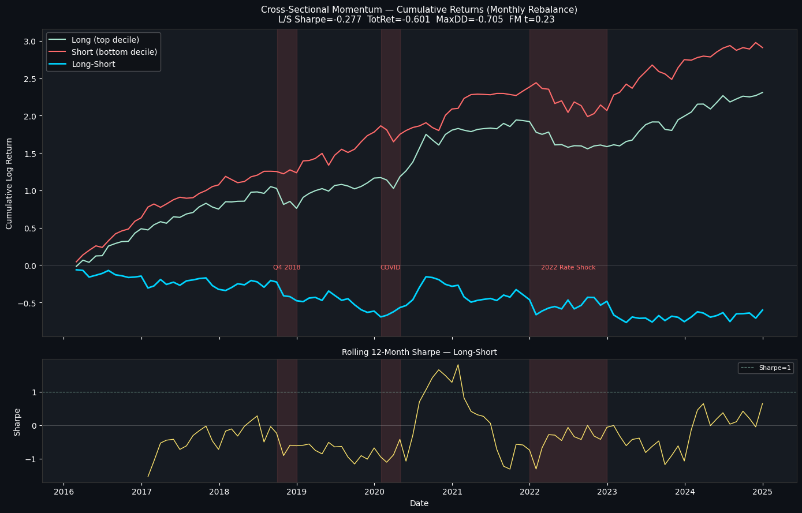
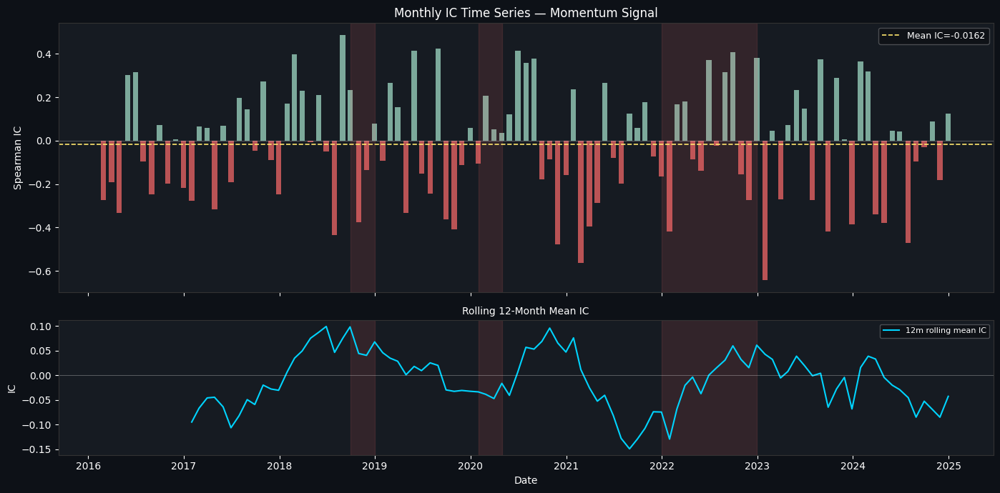
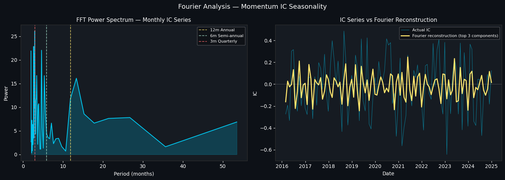
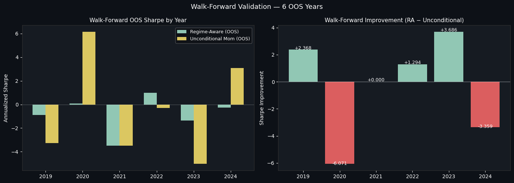

# Signal Research & Regime Detection

A rigorous out-of-sample study of classic equity trading signals in Python: statistical arbitrage (pairs), cross-sectional momentum, Fourier seasonality, hidden-Markov regime detection, and Almgren-Chriss transaction costs, all validated with walk-forward testing. The headline finding is a negative one, honestly reported: these classic signals do not survive rigorous testing on modern large-cap US equities, and this project shows why with proper statistics rather than a cherry-picked backtest.

*Boopesh Mohanraj · MS Engineering Management, Northeastern University*

---

## What this is

Most trading-strategy projects report a great backtest. The problem is that a great backtest is easy to manufacture through overfitting, look-ahead bias, and period selection, and experienced quants discount them on sight. The harder and more valuable skill is testing a signal rigorously enough to know whether it is real, and being honest when it is not.

This project takes four classic sources of equity alpha (pairs trading, momentum, calendar seasonality, and regime conditioning), tests each with the statistical machinery a research desk actually uses, and reports the results without dressing them up. On a 51-stock large-cap US universe over 2015 to 2024, the finding is consistent and unsurprising to anyone who follows the literature: **these signals have been largely arbitraged away in liquid large-caps, and none of them generates statistically significant alpha out-of-sample.** The value of the project is the rigor of the testing and the honesty of the reporting, not a performance number.

It runs six phases:

- **Universe and features** from Tiingo and FRED, with an explicit survivorship-bias note
- **Statistical arbitrage** via Engle-Granger cointegration and z-score pairs trading
- **Cross-sectional momentum** with information-coefficient and Fama-MacBeth analysis
- **Fourier seasonality** analysis of the momentum signal
- **HMM regime detection** and regime-conditional signal performance
- **Almgren-Chriss** transaction costs and walk-forward out-of-sample validation

---

## Key results

Every number below is a real output of the code in this repo. The pattern is the point: strong methodology, honestly negative results.

| Signal | Test | Result |
|---|---|---|
| **Pairs trading** | Engle-Granger + t-test | 26 of 114 pairs cointegrated, but **0 of 20** backtested pairs statistically significant; portfolio Sharpe **-0.09** |
| **Momentum (L/S)** | Fama-MacBeth + IC | Sharpe **-0.28**, FM t-stat 0.23 (p=0.82), mean IC **-0.02**: no predictive power |
| **Seasonality** | FFT + dummy regression | 12-month cycle is **3%** of spectral power: no meaningful calendar effect |
| **HMM regimes** | Gaussian HMM, 3 states | Genuinely worked: COVID crash **88%** classified as crisis; a real, validated result |
| **Walk-forward (OOS)** | 6 expanding windows | Regime-aware beat the benchmark in only **3 of 6 years**: no reliable edge |

### The one thing that genuinely worked: regime detection

The strongest and most defensible result is the hidden-Markov regime classifier. A three-state Gaussian HMM on volatility, dispersion, and yield-curve features cleanly separated trending, mean-reverting, and crisis regimes, and validated against known history: it labeled 88% of the COVID crash and 78% of the Q4 2018 selloff as crisis states. This is a genuine, historically-validated result, and it is the part of the project worth building on.





### Momentum: rigorously tested, and it does not work

Cross-sectional 12-1 momentum, the textbook equity factor, produced a long-short Sharpe of -0.28 and a total return of -60% over the period. The Fama-MacBeth t-statistic was 0.23 (p=0.82), and the mean information coefficient was slightly negative. In other words, the signal had no exploitable cross-sectional predictive power on this universe unconditionally. (It showed a faint positive Sharpe only inside detected crisis regimes, but the walk-forward test below shows that is not reliably tradeable.) This is the correct, expected result for large-cap US equities in the post-2015 era, and the project reports it plainly rather than hiding it.





### Seasonality: no real calendar effect

A Fourier decomposition of the momentum information coefficient found no dominant annual cycle: the 12-month frequency accounts for only 3% of spectral power, and neither the January effect nor a quarter-end anomaly was statistically significant. A seasonal dummy regression flagged May and August as marginally significant, but on eight to nine observations per month across a decade, that is almost certainly noise. Reported as such.



### Walk-forward validation: the honest test

The most important result is the out-of-sample one. Using expanding walk-forward windows (train on the past, test on the next unseen year, repeat), the regime-aware strategy beat the unconditional benchmark in only three of six years, with a negative average out-of-sample Sharpe. Any in-sample "improvement" from conditioning on regimes or seasonality did not survive this test, which is exactly what a walk-forward is designed to catch. This is the figure that separates a real result from an overfit one.



---

## Why this is the right result, not a failed project

Classic momentum and statistical arbitrage were profitable in academic samples largely from the 1990s and earlier. In liquid large-cap US equities since roughly 2015, they have been heavily arbitraged: transaction costs, crowding, and faster information diffusion have compressed the edge to near zero. A project that claimed a high Sharpe on this universe and period would almost certainly be overfit. The honest, rigorously-tested negative result is the more credible outcome, and demonstrating the discipline to report it is the actual skill on display here.

---

## Methodology and academic references

Each component implements a specific method. For each: what it gives, what I built, and what it produced here.

### Statistical arbitrage
*Engle & Granger (1987) cointegration; Gatev, Goetzmann & Rouwenhorst (2006) pairs trading*

- **Built:** Engle-Granger cointegration screening on same-sector pairs, then z-score entry/exit backtests with hedge ratios and a significance t-test on each pair's returns.
- **Result:** 26 of 114 pairs cointegrated, but none produced statistically significant profits after costs; portfolio Sharpe -0.09.

### Cross-sectional momentum
*Jegadeesh & Titman (1993); Fama & MacBeth (1973)*

- **Built:** 12-1 momentum signals with monthly rebalancing, information-coefficient decay analysis, and Fama-MacBeth cross-sectional regressions.
- **Result:** Sharpe -0.28, FM t-stat 0.23 (not significant), IC near zero and decaying: no exploitable signal.

### Fourier seasonality
*Standard spectral analysis*

- **Built:** FFT decomposition of the momentum IC series plus seasonal dummy regressions and calendar-anomaly tests.
- **Result:** no dominant annual cycle (12-month power share 3%); January and quarter-end effects not significant.

### HMM regime detection
*Hamilton (1989); Gaussian hidden Markov models*

- **Built:** a three-state Gaussian HMM on volatility, volatility spread, yield-curve, and dispersion features, with 30-seed model selection and validation against known market episodes.
- **Result:** clean separation of trending, mean-reverting, and crisis regimes; 88% of the COVID crash classified as crisis, validated against known market episodes. The genuinely successful component.

### Transaction costs and validation
*Almgren & Chriss (2000); walk-forward analysis*

- **Built:** an Almgren-Chriss market-impact model (temporary and permanent impact) applied to the signals, and expanding-window walk-forward validation.
- **Result:** mean roundtrip cost 10.3 bps; walk-forward confirmed no reliable out-of-sample edge, beating the benchmark in 3 of 6 years.

---

## Tech stack

| Layer | Tools |
|---|---|
| **Language** | Python |
| **Statistics** | NumPy, pandas, statsmodels (cointegration, Fama-MacBeth), SciPy (FFT) |
| **Regime modeling** | hmmlearn (Gaussian HMM) |
| **Data** | Tiingo (equity prices), FRED API (macro), 2015 to 2024 |
| **Visualization** | Matplotlib |

---

## Repository structure

```
signal_research_regime_detection.py   Full 6-phase study (Colab notebook export)
figures/                              Selected result visualizations
requirements.txt                      Dependencies
```

---

## Data and limitations

Stated plainly, because honest limitations are the entire point of this project:

- **Survivorship bias.** The universe is current S&P 500 large/mid-cap members, so stocks delisted between 2015 and 2024 are excluded, which biases returns upward. Even with that upward bias, the signals still do not work, which strengthens the negative finding. Walk-forward validation partially mitigates this.
- **In-sample seasonality is not tradeable.** The Fourier-adjusted position sizing improves the in-sample Sharpe only because it uses full-sample knowledge to flatten historically weak months. This is look-ahead bias and does not survive walk-forward, which is why it is not presented as a positive result.
- **Universe and period specificity.** These findings apply to liquid large-cap US equities over 2015 to 2024. The same signals can behave differently in small-caps, other regions, or other eras; the negative result is not a universal claim.
- **Small monthly samples for seasonality.** Calendar tests rest on eight to nine observations per month across the decade, so marginal significance (May, August) should be read as noise.
- **Transaction cost calibration.** The Almgren-Chriss parameters are reasonable defaults, not calibrated to each name's true impact; illiquid pairs would face materially higher costs.

---

*Part of a six-project quantitative finance portfolio. Data from Tiingo and the FRED API. Research and educational project, not investment advice.*
